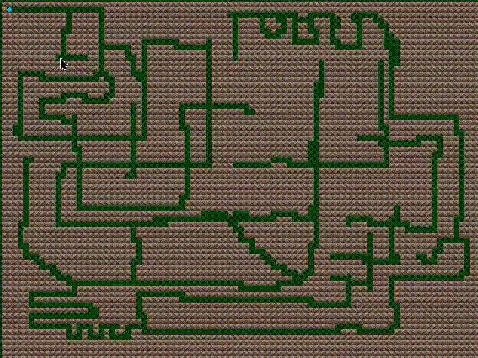

TopdownGame
===========

A prototype for a top-down game with a tile-based world.

Includes:
- A movable entity which uses a custom pathfinding algorithm
- An editable tile-based world
- A fancy viewport which is separate from the window

Made in C++20 with the SDL and SDL_image libraries.

Demonstration
-------------

### World-editing and pathfinding

### Pathfinding

### Separated viewport which shows how only the necessary tiles are rendered

Note: The black bars are transparent for demonstration.

### Ditto

